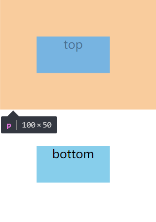

# 1. BFC
  * ## 定义：
    **BFC(Block formatting context)** 直译为"块级格式化上下文"。它是一个独立的渲染区域，只有Block-level box参与， 它规定了内部的Block-level Box如何布局，并且与这个区域外部毫不相干。

  * ## 布局规则：
    - 内部的Box会在垂直方向，一个接一个地放置。
    - Box垂直方向的距离由margin决定。属于同一个BFC的两个相邻Box的margin会发生重叠。
    - 每个元素的margin box的左边， 与包含块border box的左边相接触(对于从左往右的格式化，否则相反)。即使存在浮动也是如此。
    - BFC的区域不会与float box重叠。
    - BFC就是页面上的一个隔离的独立容器，容器里面的子元素不会影响到外面的元素。反之也如此。
    - 计算BFC的高度时，浮动元素也参与计算

  * ## BFC的生成：
    - 根元素或其它包含它的元素
    - float属性不为none
    - overflow的值不为visible
    - position为absolute或fixed
    - display的值为inline-block、table-cell、table-caption、flex、inline-flex

  * ## BFC的应用：
    ### 1. 防止垂直 margin 重叠
      * #### 示例：
        ```html
        <!DOCTYPE html>
        <html lang="en">
          <head>
            <meta charset="UTF-8">
            <title>BFC</title>
            <style>
              p {
                margin: 50px;
                width: 100px;
                height: 50px;
                text-align: center;
                background-color: skyblue;
              }
              div {
                position: absolute;
              }
            </style>
          </head>
          <body>
            <p>top</div>
            <div class="bfc">
              <p>bottom</div>
            </div>
          </body>
        </html>
        ```
      * #### 页面效果：
        

  * 参考链接：
    - http://www.cnblogs.com/lhb25/p/inside-block-formatting-ontext.html
    - https://segmentfault.com/a/1190000012221820